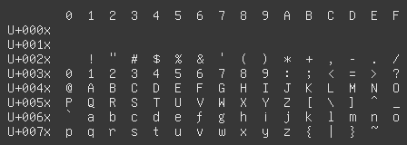

phantasm
========

a font for myself 🐈

generated using pure posix utils

features
========

- stylized f and r
- braille as drawing characters
- merges over unifont

todo
====

- rewrite the slow scripts (hex2bdf.awk)
- more stylistic changes
- icons in private use area

note
====

to generate/update the previews, imagemagick convert is required

license
=======

all tracked files and scripts are released into the public domain (CC0)

links
=====

- http://czyborra.com/unifont/
- http://unifoundry.com/unifont/index.html
